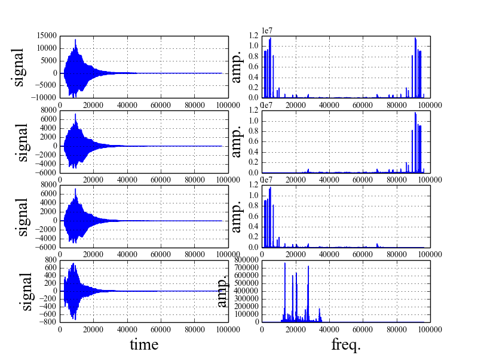

# 音声を入力して, ローパス, バンドパス, ハイパスに通します
* 環境
python3
* 実行コマンド
python Fourier.py

* 入出力
input test.wav
output low.wav, band.wav, high.wav

フーリエ変換の手法として
FFT, DFTを利用しています.
実行時間の差分を表示するために
両方利用しているので必要でなければDFT を削除してください.

